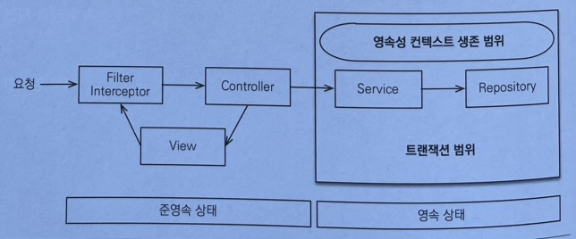
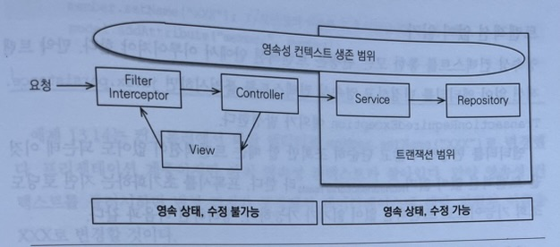

# JPA_Study
자바ORM표준 JPA 프로그래밍 책을 읽으면서 공부하는 중입니다!

## 개발환경
- SpringBoot `3.2.5`
- gradle `8.7`
- java `17`
- DB : `H2`
- Depencency : `Spring Data JPA`, `querydsl` `Lombok` `Validation` `Thymeleaf`
- 그외 : `jquery` `bootstrap` `sweetalert2`

## querydsl 설정 (springboot 3.0 이상)
```xml
//dependency 추가
implementation 'com.querydsl:querydsl-jpa:5.0.0:jakarta'
annotationProcessor "com.querydsl:querydsl-apt:${dependencyManagement.importedProperties['querydsl.version']}:jakarta"
annotationProcessor "jakarta.annotation:jakarta.annotation-api"
annotationProcessor "jakarta.persistence:jakarta.persistence-api"

//script 작성
def querydslDir = "src/main/generated"

sourceSets {
    main.java.srcDirs += [ querydslDir ]
}

tasks.withType(JavaCompile) {
    options.getGeneratedSourceOutputDirectory().set(file(querydslDir))
}

clean.doLast {
    file(querydslDir).deleteDir()
}

//gradle 실행순서
//Gradle > Tasks > build > clean
//Gradle > Tasks > build > build
```
## 스프링 부트의 영속성 관리
### ⭐ 기본전략

- 스프링 컨테이너는 `트랙잭션 범위의 영속성 컨텍스트 전략`을 기본으로 사용한다.
- 보통 비즈니스 로직을 시작하는 서비스 계층에 `@Transactional` 어노테이션을 선언해서 트랜잭션을 시작한다.
- 메서드 실행 직전에 스프링의 트랜잭션 AOP가 동작해서 트랜잭션을 시작하고, 메서드가 정상 종료되면 `영속성 컨텍스트 플러시`해서 DB에 반영 후 `트랜잭션을 커밋`하면서 종료한다.
- 예외가 발생하면 `트랜잭션을 롤백`하고 종료하는데 이때는 플러시를 호출하지 않는다.
### ⭐ 준영속 상태와 지연로딩
- 컨트롤러나 뷰 같은 프리젠테이션 계층에서는 조회한 엔티티가 준영속상태가 된다.
- 따라서 변경감지와 지연로딩이 동작하지 않는다.
- 예를들어 뷰를 렌더링할 때 연관된 엔티티도 함께 사용해야 하는데, 연관된 엔티티를 지연로딩으로 설정해서 프록시 객체를 사용하면
- 영속성 컨텍스트가 없으므로 초기화를 시도하지 못하고, 예외가 발생한다.
### ⭐ OSIV를 사용해서 엔티티를 항상 영속상태로 유지

- 클라이언트에서 요청이 들어오면, 서블릿 필터나 스프링 인터셉터에서 영속성 컨텍스트를 생성한다. 이때 트랜잭션은 시작하지 않는다.
- 서비스 계층에서 트랜잭션을 시작할 때 미리 생성해 둔 영속성 컨텍스트를  찾아와서 트랜잭션을 시작한다.
- 서비스 계층이 끝나면 트랜잭션을 커밋하고 영속성 컨텍스트를 플러시한다. 이때 트랜잭션은 끝내지만 영속성 컨텍스트는 종료하지 않는다.
- 컨트롤러와 뷰까지 영속성 컨텍스트가 유지되므로 조회한 엔티티는 영속 상태를 유지한다.
- 서블릿 필터나 스프링 인터셉터로 요청이 돌아오면 영속성 컨텍스트를 종료한다. 이때 플러시를 호출하지 않고 바로 종료한다.
#### ‼️ 주의사항 ‼️
  - 컨트롤러에서 엔티티를 수정해야하는 경우, 트랜잭션이 일어나는 서비스 계층의 비즈니스 로직을 모두 수행 한 후 수정을 하도록 한다.
  - 그렇지 않은 경우, 비즈니스로직에서 변경감지가 발생하여 트랜잭션 커밋을 시키므로 의도치않은 데이터의 변경이 일어날 수 있다.